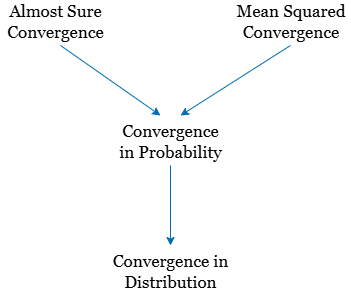
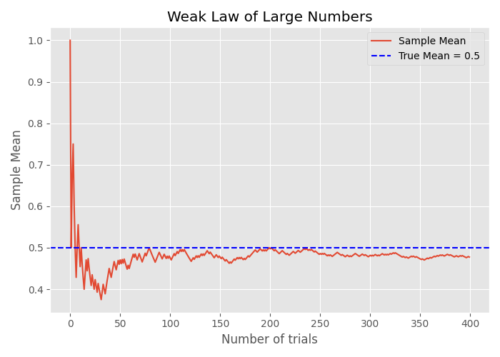

### Introduction

In the realm of probability theory and statistical inference, it's common to encounter situations where we aim to estimate an unobservable random variable $X$ through a sequence of approximations. Suppose we cannot observe $X$ directly, but we can perform measurements or experiments to obtain estimates $X_1, X_2, X_3, \ldots$. Each subsequent estimate is derived from additional data or refined methodologies, with the hope that as $n$ increases, $X_n$ provides a more accurate approximation of $X$.

This leads us to the concept of **convergence**: we are interested in understanding whether and how the sequence $\{X_n\}$ approaches $X$ as $n \to \infty$. In probability theory, convergence isn't a singular notion but encompasses various types, each capturing a different aspect of how $X_n$ may become "close" to $X$. These include:

1. **Almost Sure Convergence**: $X_n$ converges to $X$ with probability 1.
2. **Convergence in Probability**: For any $\epsilon > 0$, the probability that $|X_n - X| > \epsilon$ approaches zero as $n \to \infty$.
3. **Convergence in Distribution**: The distribution functions of $X_n$ converge to the distribution function of $X$ at all continuity points.
4. **Convergence in $L^p$ Norm**: The expected value of $|X_n - X|^p$ approaches zero as $n \to \infty$.

These are all different kinds of convergence. A sequence might converge in one sense but not another. Some of these convergence types are ''stronger'' than others and some are ''weaker.'' By this, we mean the following: If Type A convergence is stronger than Type B convergence, it means that Type A convergence implies Type B convergence. The below figure summarizes how these types of convergence are related. In this figure, the stronger types of convergence are on top and, as we move to the bottom, the convergence becomes weaker. For example, using the figure, we conclude that if a sequence of random variables converges in probability to a random variable $X$, then the sequence converges in distribution to $X$ as well.

---

### 1. Almost Sure Convergence

#### Definition

A sequence of random variables $\{X_n\}$ converges **almost surely** to a random variable $X$ if:

$$
\begin{equation}
\mathbb{P}\left( \lim_{n \to \infty} X_n = X \right) = 1
\end{equation}
$$

This means that the sequence $X_n$ converges to $X$ for almost every outcome in the sample space.
Almost sure convergence implies that, with probability 1, the sequence $X_n(\omega)$ approaches $X(\omega)$ as $n \to \infty$. It's akin to saying that the convergence happens for "almost every" individual outcome.

#### Example

Consider the sequence:

$$
X_n(\omega) = \omega^{1/n}, \quad \omega \in [0,1]
$$

As $n \to \infty$, $X_n(\omega) \to 1$ for all $\omega \in [0,1]$. Therefore, $X_n$ converges almost surely to 1.

---

### 2. Convergence in Probability

#### Definition

Convergence in probability means that the probability of $X_n$ deviating from $X$ by more than $\epsilon$ becomes negligible as $n$ grows.
A sequence $\{X_n\}$ converges **in probability** to $X$ if, for every $\epsilon > 0$:

$$
\begin{equation}
\lim_{n \to \infty} \mathbb{P}(|X_n - X| > \epsilon) = 0
\end{equation}
$$

#### Example

Define:

$$
X_n =
\begin{cases}
n, & \text{with probability } \frac{1}{n} \\
0, & \text{with probability } 1 - \frac{1}{n}
\end{cases}
$$

Then $X_n \to 0$ in probability, since:

$$
\mathbb{P}(|X_n - 0| > \epsilon) = \frac{1}{n} \to 0 \quad \text{as } n \to \infty
$$

As mentioned previously, **convergence in probability is stronger than convergence in distribution**. That is, if 
$X_n \xrightarrow{p} X$, then $X_n \xrightarrow{d} X$. The converse is not necessarily true. 

For example, let $X_1, X_2, X_3, \dots$ be a sequence of i.i.d. **Bernoulli** $\left(\frac{1}{2}\right)$ random variables. Let also $X \sim \text{Bernoulli} \left( \frac{1}{2} \right)$ be independent from the $X_i$'s. Then, $X_n \xrightarrow{d} X$. However, $X_n$ does not converge in probability to $X$, since $|X_n - X|$ is in fact also a **Bernoulli** $\left( \frac{1}{2} \right)$ random variable, and

$$
P(|X_n - X| \geq \epsilon) = \frac{1}{2}, \quad \text{for } 0 < \epsilon < 1.
$$

---

A special case in which the **converse is true** is when $X_n \xrightarrow{d} c$, where $c$ is a constant. In this case, convergence in distribution **implies convergence in probability**. We can state the following theorem:

---

#### Theorem  
If $X_n \xrightarrow{d} c$, where $c$ is a constant, then $X_n \xrightarrow{p} c$.
 
**Proof**  
 
Since $X_n \xrightarrow{d} c$, we conclude that for any $\epsilon 0$, we have:
$$
\lim_{n \to \infty} F_{X_n}(c - \epsilon) = 0,
$$
$$
\lim_{n \to \infty} F_{X_n}\left(c + \frac{\epsilon}{2}\right) = 1.
$$

We can write, for any $\epsilon > 0$,

$$
\begin{aligned}
\lim_{n \to \infty} P(|X_n - c| \geq \epsilon) &= \lim_{n \to \infty} \left[ P(X_n \leq c - \epsilon) + P(X_n \geq c + \epsilon) \right] \\
&= \lim_{n \to \infty} P(X_n \leq c - \epsilon) + \lim_{n \to \infty} P(X_n \geq c + \epsilon) \\
&= \lim_{n \to \infty} F_{X_n}(c - \epsilon) + \lim_{n \to \infty} P(X_n \geq c + \epsilon) \\
&= 0 + \lim_{n \to \infty} P(X_n \geq c + \epsilon).
\end{aligned}
$$

Now, observe that:
$$
\lim_{n \to \infty} P(X_n \geq c + \epsilon) \leq \lim_{n \to \infty} P\left(X_n > c + \frac{\epsilon}{2}\right) \\
= 1 - \lim_{n \to \infty} F_{X_n}\left(c + \frac{\epsilon}{2}\right) = 0.
$$

Hence,
$$
\lim_{n \to \infty} P(|X_n - c| \geq \epsilon) = 0, \quad \text{for all } \epsilon > 0,
$$
which means
$$
X_n \xrightarrow{p} c.
$$
The most famous example of convergence in probability is the weak law of large numbers (WLLN).

---

### 3. Convergence in Distribution

#### Definition

Convergence in distribution focuses on the behavior of the distribution functions. It implies that the distributions of $X_n$ approach the distribution of $X$ as $n \to \infty$.
Formally, a sequence $\{X_n\}$ converges **in distribution** to $X$ if, for all points $x$ where the cumulative distribution function (CDF) $F_X$ is continuous:

$$
\begin{equation}
\lim_{n \to \infty} F_{X_n}(x) = F_X(x)
\end{equation}
$$

#### Example

Let $X_n \sim \mathcal{N}(0, \frac{1}{n})$. Then $X_n$ converges in distribution to the degenerate random variable at 0, since the variance shrinks to zero.

---

### 4. Convergence in $L^p$ Norm

#### Definition
One can define convergence bwtween 2 random variables if the *distance* between the distributions $X_n$ and $X$ is decreasing to a small value. If we define distance between $X_n$ and $X$ as $P(|X_n-X|>\epsilon)$ , then we have convergence in probability, if we define distance as $p^{\text{th}}$ norm of $X_n$ and $X$, we obtain convergence in $L^p$ norm.

Formally, convergence in $L^p$ norm (or in the $p^{th}$ mean) implies that the expected $p$-th power of the difference between $X_n$ and $X$ tends to zero. Mathematically, for $p \geq 1$, a sequence $\{X_n\}$ converges in $L^p$ norm to $X$ if:
$$
\begin{equation}
\lim_{n \to \infty} \mathbb{E}[|X_n - X|^p] = 0
\end{equation}
$$
If $p=2$, it is called the mean-square convergence, and it is shown by $X_n \xrightarrow{m.s.}X$

#### Example

Let $X_n = \frac{1}{n}$. Then:

$$
\mathbb{E}[|X_n - 0|^p] = \left( \frac{1}{n} \right)^p \to 0 \quad \text{as } n \to \infty
$$

Hence, $X_n \to 0$ in $L^p$ norm.

---

### 5. Relationships Between Different Types of Convergence

As discussed previously, the different types of convergences are related to each other.

- **Almost Sure Convergence** $\Rightarrow$ **Convergence in Probability** $\Rightarrow$ **Convergence in Distribution**

- **Convergence in $L^p$ Norm** $\Rightarrow$ **Convergence in Probability**

| Type of Convergence      | Notation                    | Implies                       |
|--------------------------|-----------------------------|-------------------------------|
| Almost Sure              | $X_n \xrightarrow{a.s.} X$  | Convergence in Probability    |
| In Probability           | $X_n \xrightarrow{P} X$     | Convergence in Distribution   |
| In Distribution          | $X_n \xrightarrow{d} X$     | —                             |
| In $L^p$ Norm            | $X_n \xrightarrow{L^p} X$   | Convergence in Probability    |

However, the converses do not generally hold.

### 6. Weak Law of Large Numbers (WLLN)
#### Statement

Let $X_1, X_2, \ldots$ be i.i.d. random variables with finite mean $\mu$. Then:

$$
\begin{equation}
\bar{X}_n = \frac{1}{n} \sum_{i=1}^n X_i \xrightarrow{P} \mu
\end{equation}
$$

#### Intuition

The sample average $\bar{X}_n$ converges in probability to the expected value $\mu$ as the sample size increases.

#### Example

If $X_i \sim \text{Bernoulli}(0.5)$, then $\bar{X}_n \to 0.5$ in probability.

---
